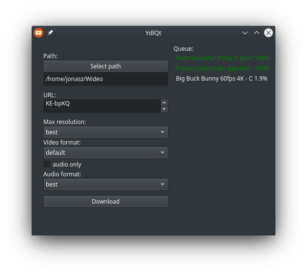

# YdlQt

**A qt frontend for youtube-dl.**



## How To Use

To clone and run this repository you'll need [Git](https://git-scm.com) and [Node.js](https://nodejs.org/en/download/) (which comes with [npm](http://npmjs.com)) installed on your computer. From your command line:

```bash
# Clone this repository
git clone https://github.com/JonaszPotoniec/YdlQt
# Install CMake
apt install cmake
# Go into the repository
cd YdlQt
# Install dependencies
npm install
# Run the dev server
npm run dev
# Open andother terminal and run the app
npm start
```
