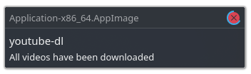

# YdlQt

**A Qt frontend for youtube-dl.**




## How To Install

Download newest version from [Releases](https://github.com/JonaszPotoniec/YdlQt/releases) tab and run it.  
If you want to change video or audio format you will also need to install [ffmpeg](https://ffmpeg.org/download.html).

On Linux you will also need [youtube-dl](http://ytdl-org.github.io/youtube-dl/download.html):

```bash
# Ubuntu-based
sudo apt install youtube-dl ffmpeg
# or
snap install youtube-dl
# Arch
sudo pacman -S youtube-dl ffmpeg
```

## How To Compile

To clone and run this repository you'll need [Git](https://git-scm.com) and [Node.js](https://nodejs.org/en/download/) (which comes with [npm](http://npmjs.com)) installed on your computer. From your command line:

```bash
# Clone this repository
git clone https://github.com/JonaszPotoniec/YdlQt
# Install dependencies
apt install cmake mesa-common-dev libglu1-mesa-dev
# Go into the repository
cd YdlQt
# Install dependencies
npm install
# Run the dev server
npm run dev
# Open andother terminal and run the app
npm start
```
